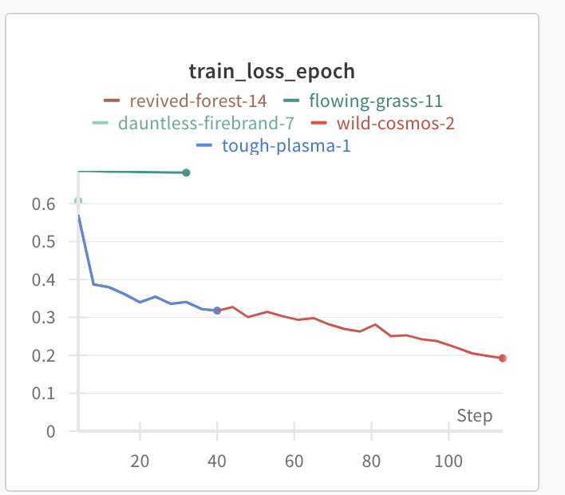
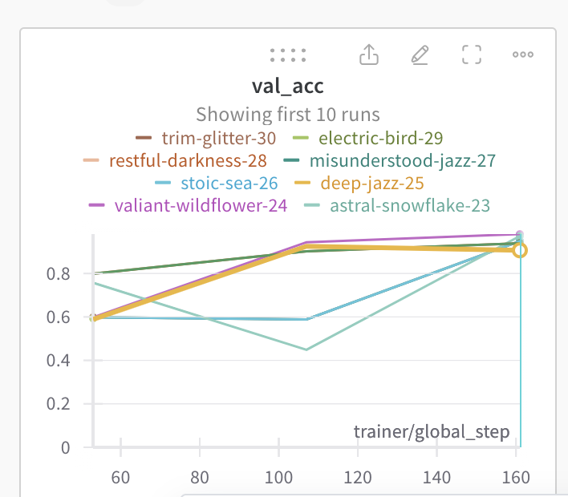
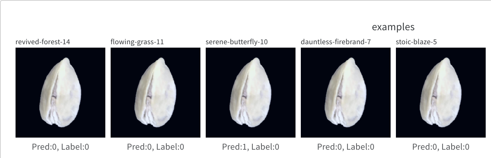
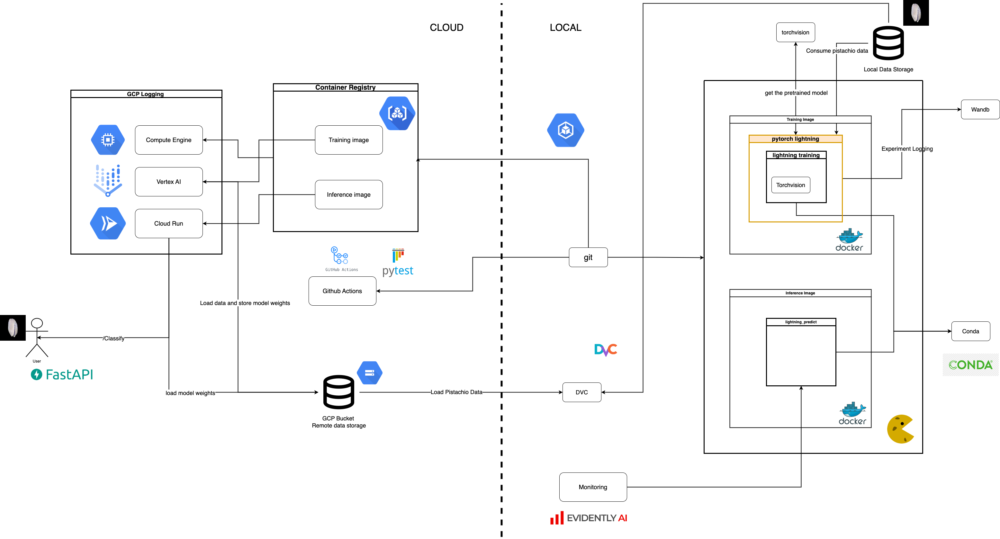

# Exam Group 97 02476 Machine Learning Operations

## Overall project checklist

The checklist is *exhaustic* which means that it includes everything that you could possible do on the project in
relation the curricilum in this course. Therefore, we do not expect at all that you have checked of all boxes at the
end of the project.

### Week 1

* [ok] Create a git repository
* [ok] Make sure that all team members have write access to the github repository
* [ok] Create a dedicated environment for you project to keep track of your packages
* [ok] Create the initial file structure using cookiecutter
* [ok] Fill out the `make_dataset.py` file such that it downloads whatever data you need and
* [ok] Add a model file and a training script and get that running
* [ok] Remember to fill out the `requirements.txt` file with whatever dependencies that you are using
* [ok] Remember to comply with good coding practices (`pep8`) while doing the project
* [ok] Do a bit of code typing and remember to document essential parts of your code
* [ok] Setup version control for your data or part of your data
* [ok] Construct one or multiple docker files for your code
* [ok] Build the docker files locally and make sure they work as intended
* [ok] Write one or multiple configurations files for your experiments
* [ok] Used Hydra to load the configurations and manage your hyperparameters
* [ ] When you have something that works somewhat, remember at some point to to some profiling and see if
      you can optimize your code
* [ok] Use Weights & Biases to log training progress and other important metrics/artifacts in your code. Additionally,
      consider running a hyperparameter optimization sweep.
* [ok] Use Pytorch-lightning (if applicable) to reduce the amount of boilerplate in your code

### Week 2

* [ok] Write unit tests related to the data part of your code
* [ok] Write unit tests related to model construction and or model training
* [ok] Calculate the coverage.
* [ok] Get some continuous integration running on the github repository
* [ok] Create a data storage in GCP Bucket for you data and preferable link this with your data version control setup
* [ok] Create a trigger workflow for automatically building your docker images
* [ok] Get your model training in GCP using either the Engine or Vertex AI
* [ok] Create a FastAPI application that can do inference using your model
* [ ] If applicable, consider deploying the model locally using torchserve
* [ ] Deploy your model in GCP using either Functions or Run as the backend

### Week 3

* [ ] Check how robust your model is towards data drifting
* [ok] Setup monitoring for the system telemetry of your deployed model
* [ok] Setup monitoring for the performance of your deployed model
* [ ] If applicable, play around with distributed data loading
* [ ] If applicable, play around with distributed model training
* [ ] Play around with quantization, compilation and pruning for you trained models to increase inference speed

### Additional

* [ok] Revisit your initial project description. Did the project turn out as you wanted?
* [ok] Make sure all group members have a understanding about all parts of the project
* [ok] Uploaded all your code to github

## Group information

### Question 1
> **Enter the group number you signed up on <learn.inside.dtu.dk>**
>
> Answer:

97

### Question 2
> **Enter the study number for each member in the group**
>
> Answer:

s231938, s231919, s231813, s180768

### Question 3
> **What framework did you choose to work with and did it help you complete the project?**
>
> Answer:

The framework that our team has selected for the implementation of the project has been Torchvision. The decision of using this framework was driven by its integration with PyTorch and the wide availability of pre-trained models. Our project is focussing on the binary classification of pistachio images, where we have two classes (Kirmizi and Siirt). Those different models provided by the framework were very suitable for our transfer learning process. We opted for the ResNet50 pre-trained model for the completion of this project as its architecture is widely known, its performance in extracting features is really solid and because of its success in many image classification tasks.

## Coding environment

> In the following section we are interested in learning more about you local development environment.

### Question 4

> **Explain how you managed dependencies in your project? Explain the process a new team member would have to go**
> **through to get an exact copy of your environment.**
>
> Answer:

We have established a requirements.txt file to manage the dependencies within our project. This file lists all the necessary packages for the project to function correctly, so when the project is executed, it automatically checks if these packages are installed and installs any that are missing. This ensures that new team members can easily set up, execute, and modify the project without hassle.

### Question 5

> **We expect that you initialized your project using the cookiecutter template. Explain the overall structure of your**
> **code. Did you fill out every folder or only a subset?**
> Answer:

For the creation of the initial structure of the project we have make use of the provided template by cookiecutter. After finishing all the code, we revisited the initial structure and deleted the folders which were empty. These folders have been 'notebooks', 'references' and 'data'. We have added new folders to the initial structure to make our project work. We will not mention all the folders here as the final structure can be found in the overall README.md of the project. But for example, the folder related to the tests have been added containing all the different scripts for making the unit tests. Another example has been the deletion of the 'data' folder because we have stored all the necessary data in the cloud.

### Question 6

> **Did you implement any rules for code quality and format? Additionally, explain with your own words why these**
> **concepts matters in larger projects.**
>
> Answer:

Yes, we implemented rules for code quality and format using Ruff. These rules include import sorting, conventions, errors and warnings to ensure consistent and readable code. In larger projects, these concepts may have a notable importance. A big project will have many people involved. Those people will naturally have a different type of coding, thus maintaining code quality and format is crucial for collaboration and maintainability. It can improve the understanding of the code, reduce errors and also achieve an unified coding style.

## Version control

> In the following section we are interested in how version control was used in your project during development to
> corporate and increase the quality of your code.

### Question 7

> **How many tests did you implement and what are they testing in your code?**
>
> Answer:

We have implemented a total number of 6 tests. We have followed the intructions given by the instructors and created unit tests related to the data part of our code and the model. The tests related to the data check important properties, providing assertions for key aspects such as the presence of data and labels, the correct shape of images, and the validity of labels. It uses the pytest framework for test organization and execution. Regarding to the model tests, both of them are brief and focus on fundamental aspects, such as output shape and model architecture. Finally, training tests evaluate the TransferLearningModel for proper instantiation, forward pass functionality, and optimizer/scheduler configuration. It ensures correct construction, output shape during a forward pass, and the expected optimizer/scheduler classes.

### Question 8

> **What is the total code coverage (in percentage) of your code? If you code had an code coverage of 100% (or close**
> **to), would you still trust it to be error free? Explain you reasoning.**
>
> Answer:

The total code coverage of code is 38%. The coverage report shows that the listed files, including `__init__.py` files and `build_features.py`, have 100% coverage. This means that all lines in these files are covered by tests. High coverage percentages in these files are a positive sign, suggesting that tests effectively validate the functionality implemented in these modules. The focus may need to be on increasing coverage in `lightning_train.py`, where a lower percentage suggests areas that are not thoroughly tested. Even if your code has a very high coverage, it doesn't ensure that there are no errors. While good testing can catch many issues, it might miss some complex situations or unique cases. Also, the quality of tests matters; they should be well-crafted to truly check if the code is correct. So, high coverage is good, but it's best when combined with other testing methods like unit tests, integration tests, and manual testing to make sure your software is strong and dependable.

### Question 9

> **Did you workflow include using branches and pull requests? If yes, explain how. If not, explain how branches and**
> **pull request can help improve version control.**
>
> Answer:

We didn't use branches and pull requests in our workflow. However, if we had, it would have helped by allowing us to work on different parts of the code separately. Branches act like different workspaces for features or fixes. Pull requests then let us propose changes and get them reviewed before adding them to the main code. This helps catch mistakes early, keeps the main code clean, and allows multiple team members to work on things simultaneously without conflicts. Not using branches and pull requests might mean missing out on these benefits, making collaboration less organized and potentially causing issues in the code.

### Question 10

> **Did you use DVC for managing data in your project? If yes, then how did it improve your project to have version**
> **control of your data. If no, explain a case where it would be beneficial to have version control of your data.**
>
> Answer:

We integrated Data Version Control (DVC) into our project through a two-stage approach: Initially, we established a connection between our data and a Google Drive repository,  this setup served as our preliminary versioning system. Subsequently, we transitioned to linking our data with Google Cloud Storage,  this shift enabled us to leverage the cloud's capabilities for maintaining multiple versions of our data, ensuring more robust and scalable data management.

### Question 11

> **Discuss you continues integration setup. What kind of CI are you running (unittesting, linting, etc.)? Do you test**
> **multiple operating systems, python version etc. Do you make use of caching? Feel free to insert a link to one of**
> **your github actions workflow.**
>
> Answer:

Our continuous integration (CI) setup relies on GitHub Actions, featuring a "Run tests" workflow triggered by pushes and pull requests to the `master` and `main` branches. This workflow, executed on the latest Ubuntu version, follows a sequence of essential steps. It starts by fetching the latest code, proceeds to set up the Python 3.8 environment using the `setup-python` action, and installs project dependencies from `requirements.txt` and `requirements_tests.txt`. The workflow then runs the test suite with pytest, ensuring unit tests are executed successfully. To optimize workflow efficiency, dependencies are cached using the `actions/cache` action, reducing redundant installations. While the current configuration targets Ubuntu, future improvements could involve testing on additional operating systems and Python versions by extending the workflow. You can find the GitHub Actions workflow [here](https://github.com/eduardpuga/MLOPS_group97/actions/workflows/tests.yml).

## Running code and tracking experiments

> In the following section we are interested in learning more about the experimental setup for running your code and
> especially the reproducibility of your experiments.

### Question 12

> **How did you configure experiments? Did you make use of config files? Explain with coding examples of how you would**
> **run a experiment.**
>
> Answer:

The experiments are configured using the 'click' library for command-line interface (CLI) options and arguments, with required input data filepath and optional settings for learning rate, batch size, and maximum epochs.

python pistachio/src/models/lightning_train.py data/raw --lr 1e-3 --batch_size 25 --max_epochs 2

--- question 12 fill here ---

### Question 13

> **Reproducibility of experiments are important. Related to the last question, how did you secure that no information**
> **is lost when running experiments and that your experiments are reproducible?**
>
> Answer:

We ensured the reproducibility of our experiments by adopting a Dockerized approach by implementing several Dockerfiles. Each experiment is encapsulated within a Docker container, containing not only the source code but also specific combinations of hyperparameters specified in the entry point of the dockerfile. We managed to perform a few experiments using this approach and to reproduce one of this experiemnts one would have to download the image and run it in its machine.

### Question 14

> **Upload 1 to 3 screenshots that show the experiments that you have done in W&B (or another experiment tracking**
> **service of your choice). This may include loss graphs, logged images, hyperparameter sweeps etc. You can take**
> **inspiration from [this figure](figures/wandb.png). Explain what metrics you are tracking and why they are**
> **important.**
>
> Answer:

We tracked our experiments using W&B. We selected several metrics to log and compare all our experiments. The dashboard of our W&B account shows these metrics. On top of that we also displayed some example images of the ones the model was classifying to see that the input of the model was correct.

As seen in the first image we tracked the training loss of the experiments, this is important to see that the models are learning and not overfitting over the time:

As seen in the second image we also compared the validation accuracy of all the experiments we did achieving really impresive scores, this is important because the model is validated using unseen data during the training:

As seen in the third image we also displayed example pistachio images before the train.

### Question 15

> **Docker is an important tool for creating containerized applications. Explain how you used docker in your**
> **experiments? Include how you would run your docker images and include a link to one of your docker files.**
>
> Answer:

We did our model's training process in the cloud using Docker, creating a dedicated training.dockerfile. The execution of these Docker images is managed through custom jobs, configured in a config.yaml file that executed a specific docker image on Vertex AI. Furthermore, for the deployment of the model in the cloud, we have crafted a separate Docker file, termed inference.dockerfile.

[Dockerfile of the training](/training.dockerfile)

### Question 16

> **When running into bugs while trying to run your experiments, how did you perform debugging? Additionally, did you**
> **try to profile your code or do you think it is already perfect?**
>
> Answer:

Regarding to debugging, we have not performed any special actions. Although we did not try to profile our code, we already know that the code is not perfect and that there are many aspects that could be improved. We have put more attention in building a correct pipeline and focussing in achieving a correct functionality.

## Working in the cloud

> In the following section we would like to know more about your experience when developing in the cloud.

### Question 17

> **List all the GCP services that you made use of in your project and shortly explain what each service does?**
>
> Answer:

In our project, we've effectively utilized a range of Google Cloud Platform services. We've stored all project data in Google Cloud Storage, integrating it with the Data Version Control (DVC) system for efficient data management. For continuous integration, Cloud Build has been set up to trigger automatically with each GitHub commit, streamlining our development process. Our Docker images, generated from Dockerfiles, are managed and stored securely using Container Registry. Additionally, we use Vertex AI for training our machine learning models, taking advantage of cloud-based GPUs for enhanced performance and efficiency.

### Question 18

> **The backbone of GCP is the Compute engine. Explained how you made use of this service and what type of VMs**
> **you used?**
>
> Answer:

We opted not to utilize Google Compute Engine in our project, choosing instead to harness the capabilities of Vertex AI for model training. Vertex AI provided a more streamlined and integrated environment for our specific needs, tis decision was driven by Vertex AI's ability to efficiently manage the training process, leveraging advanced machine learning tools and GPU resources. While Google Compute Engine is indeed a powerful tool for creating and managing virtual machines remotely, which can be highly beneficial for various computing tasks including model training, our project requirements aligned more closely with the specialized features of Vertex AI. 

### Question 19

> **Insert 1-2 images of your GCP bucket, such that we can see what data you have stored in it.**
> **You can take inspiration from [this figure](figures/bucket.png).**
>
> Answer:

### Question 20

> **Upload one image of your GCP container registry, such that we can see the different images that you have stored.**
> **You can take inspiration from [this figure](figures/registry.png).**
>
> Answer:

### Question 21

> **Upload one image of your GCP cloud build history, so we can see the history of the images that have been build in**
> **your project. You can take inspiration from [this figure](figures/build.png).**
>
> Answer:

### Question 22

> **Did you manage to deploy your model, either in locally or cloud? If not, describe why. If yes, describe how and**
> **preferably how you invoke your deployed service?**
>
> Answer:

We manage to deploy the model both locally and in the cloud, we firstt tried locally serving the model, which worked and then we decided to implemented in the cloud too. To deploy the model we used "inference.dockerfile" in order to create the image and then run inn a container. In order to invoke the fast api to connec with the service deployed we used "https://pistachioapi-y2hpxj763q-ew.a.run.app/docs#/default/classify_image_classify_post"

### Question 23

> **Did you manage to implement monitoring of your deployed model? If yes, explain how it works. If not, explain how**
> **monitoring would help the longevity of your application.**
>
> Answer:

We created a monitoring file (monitoring.py) using the evidently library.
To run our monitoring experiment we generated some "corrupted" images by rotating our original images (90 degrees).
Images are not structured tabular data, so we couldn't monitor the changes in the features when new data is added.
For this reason we decided to monitor the performance of our model when new images are used. 
The prediction matrices that we decided to include are:
Accuracy
Prediction
Recall
F1

Our Monitoring code generates both: 
1) an .html report for an easy inspection of the monitoring results
2) a dictionary/json file that can be embedded in an automated routine to produce warning about the quality of the new data used in the model

### Question 24

> **How many credits did you end up using during the project and what service was most expensive?**
>
> Answer:

Our group incurred a total expense of $7.32 for the project. The highest cost was attributed to cloud storage, primarily for storing the data and the model. This was followed by the expenses for deploying the model. The least costly aspect was the use of Vertex AI.

## Overall discussion of project

> In the following section we would like you to think about the general structure of your project.

### Question 25

> **Include a figure that describes the overall architecture of your system and what services that you make use of.**
> **You can take inspiration from [this figure](figures/overview.png). Additionally in your own words, explain the**
> **overall steps in figure.**
>
> Answer:

We started by implementing our project in our local setup where we get the repository structure using cookie cutter and later we integrate pytorch lightning and torchvision into our code to build the model. Additionally, we implemented several unit tests to check the quality of the code and data. Whenever we commit code and push to github, it auto triggers two images buildings one for training and one for inference. After that both images are pushed into the container registry and after that Vertex AI run the training image to get the model weights that are stored in our GCP bucket. These weights are retrieved by the new service created inside Cloud Run that runs the inference image and automatically deploys our application with FastAPI and serves a method to classify pistachio images.

### Question 26

> **Discuss the overall struggles of the project. Where did you spend most time and what did you do to overcome these**
> **challenges?**
>
> Answer:

The biggest challenge while working in this project has been, by far, dealing with the cloud. It has been the part of the project where we have spent most of the time. When correcting the error, new ones were created. Working in the world of the Cloud has been something new for all of us. Although in the end we ended up liking it, it has been an overall nightmare. Thanks to the help of Nicky, TA's and Google, we finally managed to deal with the Cloud and make our project execute correctly.

Another little inconvenience that we have encountered has been to deal with some merge conflicts in GitHub. As mentioned before, we did not make use of the branches, and it is something that we have ended up regreting. In the beginning, as we were working all together in the same place, there were no problems. However, the last days of the project we have noticed many merge problems and some of the code have been overwritten and so on. So, for the next project, we all know that we will make use of branches.

### Question 27

> **State the individual contributions of each team member. This is required information from DTU, because we need to**
> **make sure all members contributed actively to the project**
>
> Answer:

1) Student s231938: initial creator of the GitHub repository. Helped in all the lightning related scripts creation. Responsible of the Continous Integration, cache creation and unit testing. Also made the visualization task. Took care of the fullfiment of the good coding practices and contributed to all the docummentation files equally.
2) Student s231813: Responsible for the project code including torchvision framework, lightning and hyperparameter experiments. Has also taken care for the training logging using Weights and Biases. Helped in the Continuous Integration and Google Cloud setting up. Responsible of the Deployment through Google Cloud Run and FastAPI. Helped in all the storage related tasks and contributed with the documentation equally.
3) Student s231919: Responsible for the Google Cloud section, including Cloud Storage using DVC, creation of the Trigger and link of hte google cloud with the GitHub repository and creation of the images of the Dockerfiles. Helped in the deployment through Google Cloud Run, in the creation of unit tests for the project, and contributed to the documentation equally.
4) Student s180768: Researcher for the project idea. Responsible for the monitoring section including Evidently AI. Helped in the code development and Continuos Integration Part. Also responsible of the hyperperameters experiments and helped in the Cloud Storage section. 
